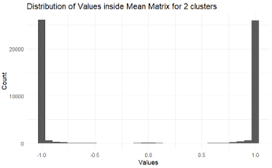
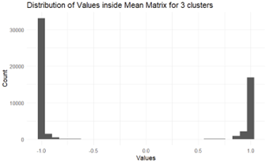

---
format:
  pdf:
    documentclass: report
    papersize: letter
    fontsize: 12pt
    mainfont: Times New Roman
    geometry:
      - left=1.5in
      - right=1in
      - top=1in
      - bottom=1in
    include-before-body:
      - frontmatter/information.tex
      - frontmatter/title-page.tex
      - frontmatter/copyright-page.tex
      - frontmatter/committee-page.tex
      - frontmatter/abstract.tex
      - frontmatter/acknowledgments.tex
      - frontmatter/table-of-contents.tex
    number-sections: true
    citation-style: apa
    bibliography: bibliography/example-bibliography.bib
    csl: bibliography/apa-6th-edition.csl
    include-in-header: frontmatter/formating.tex
---

```{r}
#| lablel: set-up
#| include: false # Use to hide code and results
library(tidyverse)
library(kableExtra)
library(foreach)
library(doParallel)
library(cluster)
```

# The Problem and What's been Tried

## Motivation

Unsupervised clustering algorithms such as K-Means and hierarchical clustering are commonly used today when the number of clusters in a given dataset is not known beforehand, differentiating it from supervised clustering. Kodinariya (2013) presents the most common approaches used, such as the elbow method and Silhouette score. However, even with these scores there are often disagreements and caveats. For example, the elbow method sometimes presents itself as having no elbow, and the definition of an "elbow" is sometimes ambiguous (we need a source for this later). There are also cases where the scores don't necessarily agree, causing confusion in what score to believe.

```{r}
data <- data.frame(rbind(
  cbind(rnorm(50, -5), rnorm(50, -5)),
  cbind(rnorm(50, 0), rnorm(50, 0)),
  cbind(rnorm(50, 5), rnorm(50, 5))))

res <- lapply(c(1:7), function(i) {
  WCSS <- kmeans(data,
                centers = i, nstart = 10)$tot.withinss
  return(data.frame(i = as.vector(i),
                    WCSS = as.vector(WCSS)))
}) 
bind_rows(res) |> 
  ggplot(aes(x = i, y = WCSS)) +
  geom_point() +
  geom_line() +
  theme_minimal() +
  scale_x_continuous(breaks = 1:7)


ggplot(data = data, aes(x = X1, y = X2)) +
  geom_point()


data <- data.frame(rbind(
  cbind(rnorm(50, -1), rnorm(50, -1)),
  cbind(rnorm(50, 0), rnorm(50, 0)),
  cbind(rnorm(50, 1), rnorm(50, 1)),
  cbind(rnorm(50, 2), rnorm(50, 2))))

res <- lapply(c(1:7), function(i) {
  WCSS <- kmeans(data,
                centers = i, nstart = 10)$tot.withinss
  return(data.frame(i = as.vector(i),
                    WCSS = as.vector(WCSS)))
}) 
bind_rows(res) |> 
  ggplot(aes(x = i, y = WCSS)) +
  geom_point() +
  geom_line() +
  theme_minimal() +
  scale_x_continuous(breaks = 1:7)


ggplot(data = data, aes(x = X1, y = X2)) +
  geom_point()
```


We present the cRab algorithm, which utilizes random subsampling of a dataset in order to determine the optimal number of clusters for an unsupervised clustering algorithm.

There will probably be lots of citations here for many articles or even software like R [@r_core_team_2025]. [@ben-hur_stability_2001]. [@jaeger_cluster_2023]. [@tidymodels_2020]. [@tidyclust_2025]. [@tidyverse_2019].


## Literature Review

# Details

## Calculated
## Performance on Simulated Data
## Sensitivity
## Known Data

## Performance on penguins dataset

|                        |           |
|------------------------|-----------|
| **Number of Clusters** | **Score** |
| 2                      | 393.928   |
| 3                      | 71.5394   |
| 4                      | 7147.85   |
| 5                      | 4228.18   |
| 6                      | 4700.21   |
| 7                      | 4562.12   |
| 8                      | 4427.73   |
| 9                      | 4246.44   |
| 10                     | 3567.82   |


# Computational Details

## Matrix Stacking

## Algorithm Construction

The main principle of our algorithm works off of is the fact that subsamples of a dataset should still capture the overall clustering structure, which is also echoed in the paper from Ben-Hur (2002). This means that given two distinct points and their cluster assignments across resamples, the clustering assignments should be consistent. For example, two points that are far away from each other should consistently not be in the same cluster, and two points that are close together should consistently be in the same cluster, even across resamples.

A "clustering assignment matrix" for each resample is then needed, where for points $i$ and $j$ we have a value of 1 in the matrix if they belong to the sample cluster, -1 if not, and 0 if either point was not in the resample.

After we have n matrices, we then reduce the matrices, taking the mean with respect to each index pair, ignoring zeroes. We then receive a final "mean matrix" of size m x m, where m is the number of observations in the dataset.

## Score Construction

To illustrate the construction of the final score given this mean matrix, we use the penguins dataset in R with three known species and scaled bill length and flipper lengths.



The distribution of values inside the mean matrix after running the algorithm on the penguins dataset, using K-Means and k=2

(replace with code that generates this later)



(replace with code that generates this later)

(Also remove the images folder later)

Figure 2: The distribution of values inside the mean matrix after running the algorithm on the penguins dataset, using K-Means and k=3

We see that from Figures 1 and 2 that the distribution of values inside the mean matrix changes depending on the number of clusters set beforehand in the K-Means algorithm, albeit slightly. For k = 2, there are a small number of points around the value of 0, which indicates that these specific points are ones who are changing "allegiances" often, meaning that they switch from being "buddies" (being in the same cluster) and to being "rivals", (not being in the same cluster).

Then, to make a final score taking all this into account, we decided to vectorize this matrix, then taking the absolute value and getting the sum of squared distances from 1. This is in order to heavily penalize values that are farther from 1.


## Distribution of Ones and Neg Ones
## Speeed and Memory Scaling

It performs exponentially in terms of memory use and speed.

# Null Distribution

## Null Distribution of Scores

It is also interesting information to see what the distribution of scores looks like when there are no clusters in the dataset. This is so that our scores can be adjusted depending on this "null distribution", also allowing us to get a degree of evidence for a given k and other parameters.

```{r}
#| label: null-distribution-1
#| echo: false
#| fig-cap: "Distribution of Scores on a Random p-Dimensional Normal Distribution, Faceted by Resample %"

end_result <- read.csv(file = here::here("analyses/resampling_percentage_data/normal_resample_01.csv"))

end_result |> 
  mutate(Score = res,
         prop_resample = paste0(prop_resample * 100, "%"),
         p = factor(p),
         k = factor(k)) |> 
  ggplot(aes(x = k, y = Score, fill = p)) +
  geom_boxplot() +
  theme_minimal() +
  ggtitle(
    "Scores on a Random p-Dimensional Normal Distribution") +
  labs(subtitle = "100 Runs per Cluster, 100 Resamples with n=100 per sample") +
  facet_wrap(~prop_resample)
```

We see in the above figure that the resample proportion has a significant impact on the distribution of scores, where the variability and mean of scores over many simulation runs is dependent on the resample proportion. The scores also tend to be higher, scaling with p-dimensions, with a decreasing score distribution as k increases. Notably, all these scores look symmetrically distribution around their mean, with respect to each k.

## Null Distribution over Resamples

```{r}
#| label: table-results-1
#| echo: false
#| tbl-cap: "Variances for 20% Resample Calculation"

end_result |> 
  group_by(factor(k), factor(prop_resample)) |> 
  filter(prop_resample == 0.2) |> 
  summarize(var = sd(log(res))) |> 
  head(5) |> 
  kable()
```

# Conclusion

On the penguins dataset, we use 100 resamples and a resample proportion of 80% wih the k-Means algorithm and a given k, using again the scaled bill length and flipper lengths in our dataset.

(i guess this should also go in the analysis portion??)

# REFERENCES {.unnumbered}

::: {#refs}
:::

\appendix

<!-- Store original definitions formatting -->

\let\oldclearpage\clearpage
\let\oldcleardoublepage\cleardoublepage

<!-- Disable page breaks -->

\let\clearpage\relax
\let\cleardoublepage\relax

# Resample Matrix

<!-- Restore original formatting -->

\let\clearpage\oldclearpage
\let\cleardoublepage\oldcleardoublepage

```{r}
resample_function <- function(data = data,
                              formula = ~ .,
                              k = 3,
                              number_of_resamples = 15,
                              proportion_resample = 0.9,
                              starting_seed = 599,
                              algorithm = "kmeans") {
  data <- data |>
    drop_na()
  data$index <- 1:nrow(data)
  results <- list()

  # For loop
  results <- foreach(i = 1:number_of_resamples,
                     .packages = c("tidyclust",
                                   "dplyr",
                                   "tidymodels")) %dopar% {
     # Reproducibility over parallel
     set.seed(starting_seed + i)
     result_matrix <- matrix(0, nrow = nrow(data),
                             ncol = nrow(data))
    
     random_sample <- data |>
       filter(index %in% sample(index,
                                proportion_resample * nrow(data)))
    
     if (algorithm == "kmeans") {
       cluster_assigned <- k_means(num_clusters = k) |>
         fit({{formula}},
             data = random_sample |>
               select(-index))
     } else if (algorithm == "hier_clust") {
       cluster_assigned <- hier_clust(num_clusters = k) |>
         fit({{formula}},
             data = random_sample |>
               select(-index))
     } else {
       stop("Algorithm is not supported. Please select 
            one of (kmeans, hier_clust)")
     }
    
    
     intermediate <- data.frame(random_sample$index,
                                extract_cluster_assignment(
                                  cluster_assigned
                                  ) |>
                                  mutate(.cluster = as.character(
                                    .cluster)
                                    ),
                                stringsAsFactors = FALSE)
     colnames(intermediate) <- c("index", "cluster")
    
     for (c in unique(intermediate$cluster)) {
       idx <- intermediate[intermediate$cluster == c, ]$index
    
       # Check that the index list is not length 1 for purposes of n > m for combn
       # This also fixes a bug in the
       # previous code where idx was wrongly 
       # interpreted as single numerical
       # value as param inside combn
       if (length(idx) > 1) {
         idx <- sort(idx)
         ones <- t(combn(idx, 2))
         result_matrix[cbind(ones[, 1], ones[, 2])] <- 1
       }
    
       # Note for future self: This calculates the indices, even across y=x line
       # which means we are doing double the work for this part.
       neg_one_idx <- expand.grid(idx, setdiff(random_sample$index, idx))
       result_matrix[cbind(neg_one_idx[, 1], neg_one_idx[, 2])] <- -1
     }
     result_matrix[lower.tri(result_matrix, diag = TRUE)] <- NA
     result_matrix
    }
  return(results)
}
```

# Mean Matrix

```{r}
# Got more fancy functions, or figures, or tables, 
# or pretty much anything?

mean_matrix <- function(list_of_matrices = list_of_matrices) {
  # Absolute value the entire matrix, for all matrices
  absolute_sum <- lapply(list_of_matrices, abs)

  # Get the sum of absolute values in the final matrix
  absolute_final <- absolute_sum |>
    reduce(`+`)

  # Get the sum of values in the final matrix
  numerator <- list_of_matrices |>
    reduce(`+`)

  # Returns the matrix of zero-removed means.
  # The zero-removed mean is the sum over the (length - the number of zeroes).
  # The length - the number of zeroes is equivalent to the sum over absolute values
  return(numerator / absolute_final)
}
```

# Metric Calculation

```{r}
squared_distance_from_one <- function(mean_matrix = mean_matrix) {
  res_vec <- as.vector(mean_matrix) # Ignore the order of the elements in matrix
  res_vec <- abs(res_vec[!is.na(res_vec)]) # Absolute value and remove NAs
  return(mean((1 - res_vec)^2)) # Take average squared distance from one
}
```

# Point Contribution Function

```{r}
point_contribution <- function(data, mean_matrix) {
  # Given the original data (the dataset inputted into the resample_matrices function),
  # and the mean_matrix, returns each observation's contribution to the cRab Score.
  # We don't necessarily require the second arg to be the mean matrix, for example
  # it could be resample matrix j.
  # This is returned as an (index, score) dataframe.
  
  # Get a list of lists containing index and index "cRab" score
  scores <- lapply(c(1:nrow(data)), function(i) {
    full_vec <- getPointVecHelper(i, mean_matrix)
    singlePointScore <- mean((1 - full_vec)^2)
    return(list(index = i, singlePointScore = singlePointScore))
  })
  final_df <- do.call(rbind.data.frame, scores)
  total_score <- mean(final_df$singlePointScore)
  
  final_df <- final_df |> 
    mutate(singlePointContribution = singlePointScore / total_score)
  
  return(final_df)
}

```

# Get Point Vector Helper

```{r}
getPointVecHelper <- function(i, mean_matrix) {
  # Given a point i and the mean matrix, should
  # return vector of all values in the mean matrix corresponding to obs i
  # after removing all NAs and then taking absolute value
  
  row <- mean_matrix[i, ]
  col <- mean_matrix[, i]
  
  # We don't care about the order, just the values themselves
  res_vec <- c(row, col)
  res_vec <- abs(res_vec[!is.na(res_vec)])
  return(res_vec)
  
}
```

```{r}
# resample_matrices <- resample_function(penguins,
#                                        number_of_resamples = 40,
#                                        proportion_resample = 0.8,
#                                        starting_seed = 100)
# m_matrix <- mean_matrix(resample_matrices)
# 
# 
# d <- point_contribution(penguins, m_matrix)
# 
# test <- lapply(resample_matrices,
#        point_contribution,
#        data = penguins)
# 
# mean_var_single <- do.call(rbind.data.frame, test) |> 
#   group_by(index) |> 
#   summarize(mean = mean(singlePointScore),
#             var = sd(singlePointScore)) |> 
#   arrange(desc(var))
```
